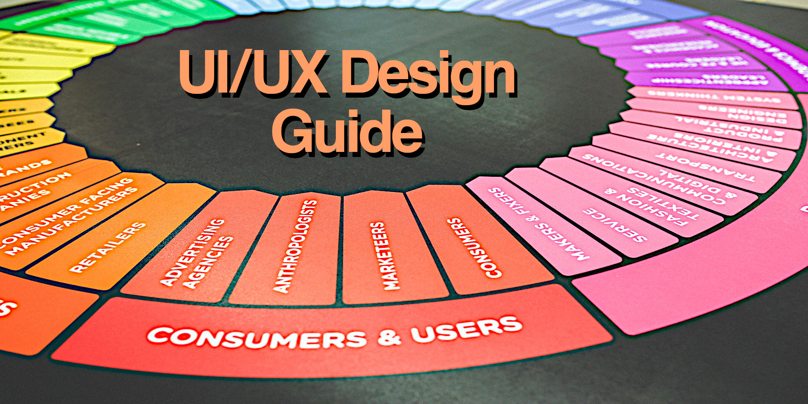

<!--
  * browser: ui-ux-design-primer
  * tracker: d3f018d32305ea599dc4b9e6f132e495
  * version: 1.3.0
  * updated: 2023-07-08T17:38:30Z
  * contact: Joel Parker Henderson (http://joelparkerhenderson.com)
  * options: commentable
-->

# UI/UX Design Primer

UI/UX Design Primer: Concepts, Tactics, Ideas.

This is a glossary guide e-book, with one topic per page. 

* Download the [free e-book](ui-ux-design-primer.pdf).
* If you wish, [pay what you want](https://gumroad.com/l/ui-ux-design-primer).
* Edited by [Joel Parker Henderson](https://github.com/joelparkerhenderson).
* For questions and suggestions, [email me](mailto:joel@joelparkerhenderson.com).

## Contents

Introduction

* What is this book?
* Who is this for?
* Why am I creating this?
* Are there more primers?

UI/UX

* User Interface (UI) + benefits
* User Experience (UX) + benefits
* Customer Experience (CX) + benefits
* Developer Experience (DX) + benefits
* User-centered design (UCD)
* Usability
* Information architecture (IA)

Design thinking

* Empathy map
* Focus group
* Personas
* Journeys
* Voice of the Customer (VoC)
* Subject matter expert (SME)
* Design charrette
* Mind map
* Decision tree
* Gamification

Design management

* Design system
* Style guide
* Pattern library
* UK Government Design Principles
* Apple Human Interface Guidelines (HIG)
* Google Material Design

Task analysis

* Cognitive task analysis (CTA)
* Hierarchical task analysis (HTA)
* Workflow analysis (HTA)
* Critical incident technique (CIT)
* Diary study
* Anticipatory design

Ideation

* Creative thinking techniques
* Brainstorming
* Active listening
* Thinking hats
* SCAMPER
* Futurespective
* Storyboard
* Storyboard - steps
* Mental model
* The map is not the territory
* Vision board
* Oblique strategies
* Abramović method

Product design

* Design canvas
* Mockups
* Wireframes
* Use cases
* User stories
* Use cases versus user stories
* MoSCoW method
* Low-fidelity prototype
* High-fidelity prototype
* WYSIWYG
* Kaizen a.k.a. continuous improvement

Modeling diagrams

* Activity diagram
* Sequence diagram
* Use case diagram
* State diagram
* Timing diagram
* Cause-and-effect diagram
* Fishbone diagram: see cause-and-effect diagram
* Ishikawa diagram: see cause-and-effect diagram
* Unified Modeling Language (UML)
* PlantUML
* Mermaid.js

North Star

* Big Hairy Audacious Goal (BHAG)
* Strategic balanced scorecard (SBS)
* Big design up front (BDUF)
* Domain-Driven Design (DDD)
* Behavior-Driven Development (BDD)
* Test-Driven Development (TDD)

Affordances

* Gibson's affordance theory
* Accordion UI
* Drawer UI
* Ribbon UI
* Tree UI
* Wizard UI
* Progress indicator
* Header and footer
* Site map
* ARIA attributes
* Model-View-Controller (MVC)
* Paper cut bug
* Dark pattern

Accessibility

* Digital inclusion
* Cross-cultural communication
* Communication styles
* Screen reader
* Keyboard shortcut (a.k.a. hotkey)
* Alternative text attribute
* Web Content Accessibility Guidelines (WCAG)
* UI for color blindness

UI/UX implementation

* Typography
* Copywriting
* Microcopy
* Iconography
* Grid system
* Mobile-first design
* Reactive UI
* Low-code / no-code
* Text-To-Speech (TTS) and Speech-To-Text (STT)
* Progressive enhancement
* Graceful degradation
* Data schema
* Object-Relational Mapper (ORM)

Internationalization and localization

* Internationalization and localization - steps
* Locale
* Locale codes
* Bidirectional text (bidi)

UX/UX testing

* Split testing
* End-to-end testing
* Acceptance testing
* Localization testing
* Accessibility testing
* Screen reader testing
* Benchmark testing
* Shift-left testing
* Heatmap

Artificial intelligence (AI)

* AI UI/UX
* AI form fill
* AI product development
* AI content generator
* AI image generation
* AI internationalization/localization

Books about UI/UX

* Universal Principles of Design by William Lidwell et al.
* The Design of Everyday Things by Donald Norman
* Envisioning Information by Edward R. Tufte
* Don't Make Me Think by Steve Krug
* Forms that Work by by Caroline Jarrett et al.
* The Humane Interface by Jef Raskin

UI/UX quotations

* Learn early, learn often
* Make mistakes faster
* Perfect is the enemy of good
* Data beats emotions

Idioms

* Quick wins
* Think outside of the box
* Out of scope
* Over the horizon
* For more see our Business Lingo Primer

Aphorisms

* The Law of Demos (Kapor's Law)
* The Law of Conservation of Complexity (Tesler's Law)
* The Pareto Principle (The 80/20 Rule)
* Chesterton's fence
* For more see our Business Lingo Primer

Soft skills

* How to create a UI/UX portfolio
* How to sketch a user interface
* How to run a focus group
* How to give a demo
* How to interview a user
* How to collaborate
* How to lead a meeting
* How to work with stakeholders
* How to get feedback
* How to give feedback

Conclusion

* About the editor
* About the AI
* About the ebook
* About related projects

## All our primers

* [Innovation Partnership Primer](https://github.com/sixarm/innovation-partnership-primer)

* [Startup Business Primer](https://github.com/sixarm/startup-business-primer)

* [Business Lingo Primer](https://github.com/sixarm/business-lingo-primer)

* [Project Management Primer](https://github.com/sixarm/project-management-primer)

* [UI/UX Design Primer](https://github.com/sixarm/ui-ux-design-primer)
